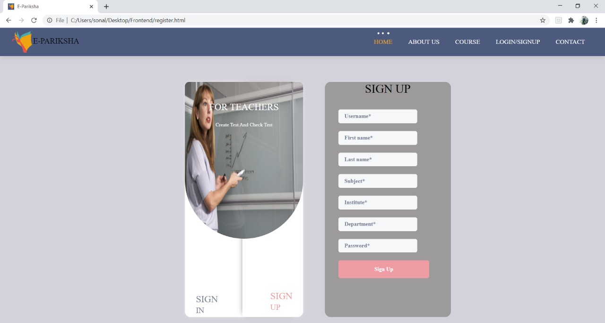
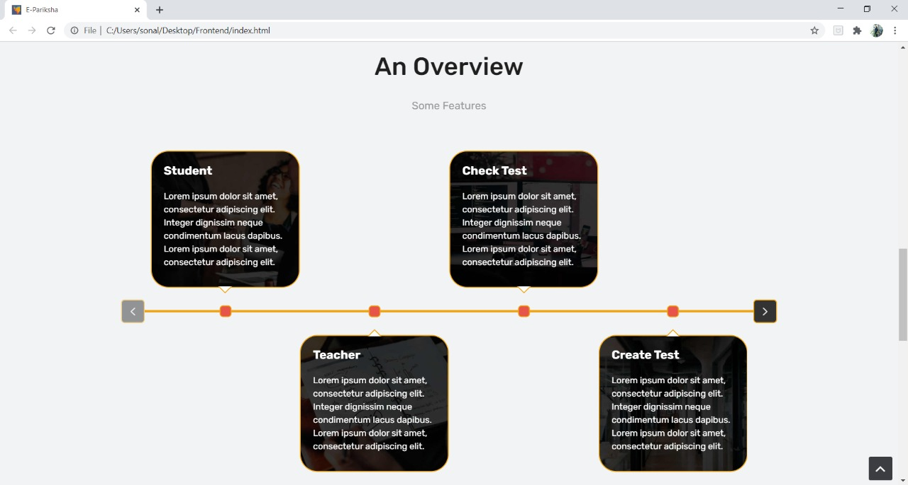
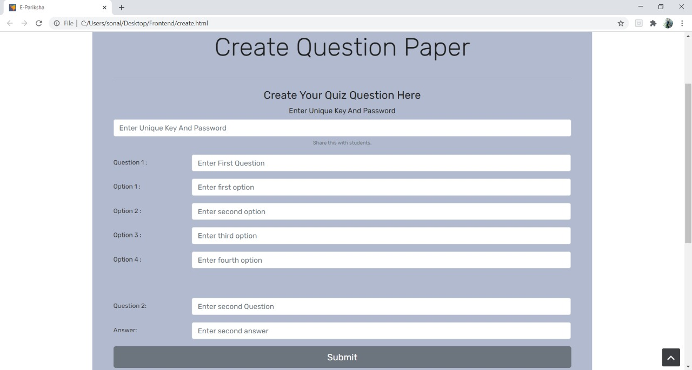
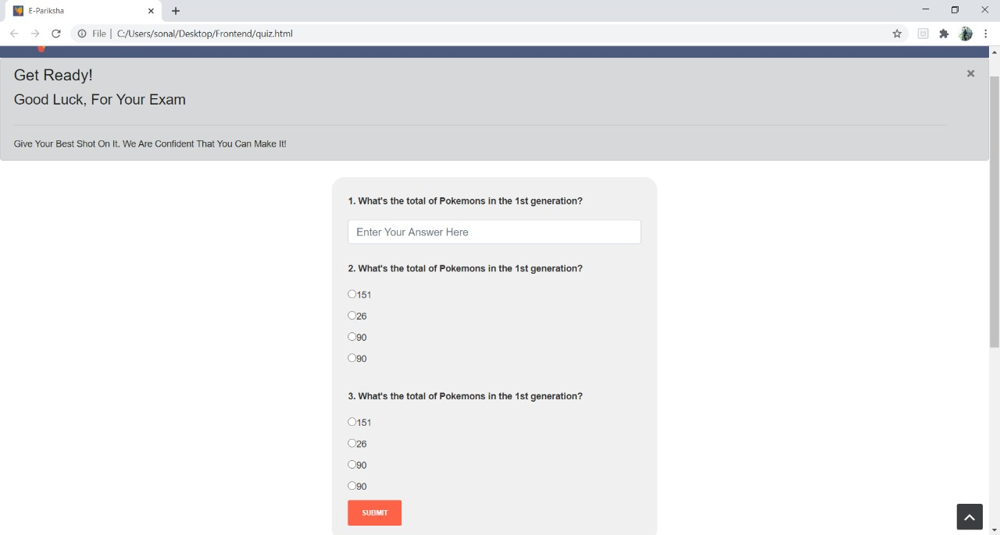
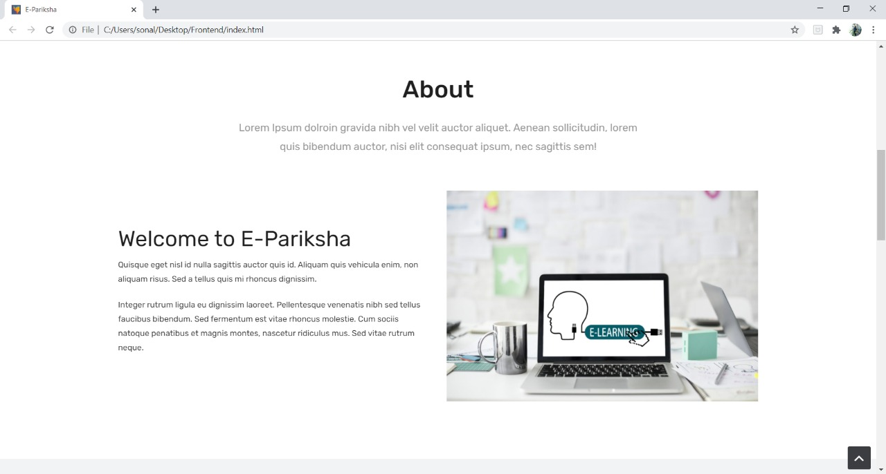

<h1> E-Pariksha </h1>
<h3>E-Pariksha - an interactive tool for Teachers and Students<h3>
 

## Problem Statement
<li>Precovid 36% of education was dependent upon e-learning in some way. Today that number is around 70%.

<li>Sudden shift in the teaching style, grading mechanism did not provided universities, teachers and students ample amount of time to get used to the learning management softwares.

<li>Most of the teachers in colleges are old aged and they are already having long screen-time due to online classes.

<li>It is difficult for them to go through the submitted answer sheets of every student, grade them, store marks, create result due to resource limitation and they being not so habitual to the softwares.

<li>Conduction of exams in a more secure way was a necessity. Current learning management system restricts subjective mode of examination by limiting students to only type the answers and not submit any diagrams. 

 

## Our Solution

### <u>Services to Teachers</u>
<b>Teacher as a answer-sheet checker</b>
<li>Teacher can manually read every student answer and can grade them manually.

<li>Teacher can upload the answer key with the right answers and required diagrams in the system. Our system will use ML model to compare the answer in answer-key with the answer in student answer-sheet. Grading will be done automatically. If summary and key-words in both the answers match than student will be assigned good marks.
 
<li>Grading of diagram based questions is possible too in an automated way.

  
<b>Teacher as a question-paper setter</b>
<li>Teacher can visit the website and can sign-in/sign-up as a teacher.
<li>Teacher can create a test with objective,subjective and diagram based questions.
<li>Teacher can make question paper containing objective as well as subjective questions.
<li>Teachers can create question paper and make it available to students only after key is entered by student.
  

### <u> Services to Students</u>

<li>Student are no more restricted to write the answers in online examinations only in the form of text. They can add flowcharts, labelled diagrams to make there answers more presentable.

<li>A user-friendly UI while writing the subjective questions motivates the student to write long answers.

<li>Student will be able to save the state of his answers in case of network issues.

<li>Student will get the results almost instantaneously if the teacher has selected automated way of grading the examinations.
   

## Tech Stack 
1)   DJango (For web app)
2)   Tensorflow, sklearn and pytorch (For ML)
3)   NLTK (For NLP)
4)   Open CV (For image processing)
5)   Tesseract (For OCR)
6)   HTML/CSS/JS (For Frontend)
7)   Git (For version control)  

## Future Scope

<li>If student is not satisfied by the grade received automatically, he/she can submit that answer for manual re-evaluation from the professor.
<li>If teacher is checking manually, those data points should be stored and later on fed into the model to train it.
<li>Grading of complicated diagrams. We can fine-tune the model based upon the stream it is gonna be used in. We could train the one-shot model on scientific diagrams if it is gonna be used in science stream.
<li>In future, once the offline exams are started, universities can scan those papers and fed it into our system for automated evaluation.   

## Buisness Model

<li>We could offer this as an extension to the learning management softwares of the universities, colleges and schools, so that efficient test-assessment system can be introduced.

<li>We could create the APIs that can be than could be incorporated with other applications like google-classroom and microsoft-teams. This can be done either in the form of API or plugin.  

## Screenshots

  

## Links for video and ppt

<a href = "https://docs.google.com/presentation/d/1tv4mXJ798eIeUXtXnNAzrAShiqcZ97E9neAFpCIM08M/edit?usp=sharing" >Presentation </a> 
<a href = "">Video </a>  

## Team Members
<a href = "https://github.com/manjotsinghbagha/">Manjot Singh</a>  
<a href = "https://github.com/JigarJoshi04/">Jigar Joshi </a>  
<a href = "https://github.com/sonali681/">Sonali Saini</a>  
<a href = "https://github.com/vaibhavarora102/">Vaibhav Arora </a> 
